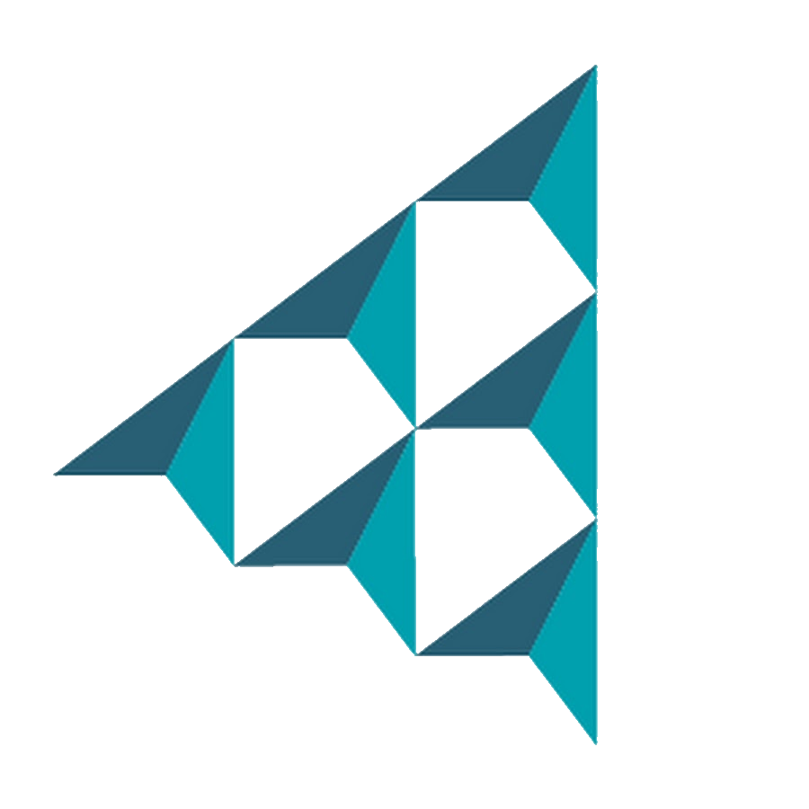

<div align="center">



<br><br>

<picture>
  <source media="(prefers-color-scheme: dark)" srcset="assets/readme/hero-dark.svg">
  <source media="(prefers-color-scheme: light)" srcset="assets/readme/hero-light.svg">
  
</picture>

<br>

<a href="https://debate-planner-jd-fr.streamlit.app/">
  
</a>
&nbsp;
<a href="#installation-locale">
  
</a>

<br><br>

**[Comment ça marche ?](#comment-ça-marche)** ·
**[Sauvegarde](#en-ligne-ou-en-local)** ·
**[Installation](#installation-locale)** ·
**[FAQ](#faq)** ·
**[Contact](#aide--contact)**

</div>

---

## Le planificateur, simplement

Le **Planificateur de débats** prépare automatiquement le planning d'une finale régionale de **La jeunesse débat**.

Vous indiquez les équipes et les salles disponibles.  
L'application organise les **rencontres, questions, rôles, sessions et salles**, puis vérifie automatiquement le résultat.

<br>

<picture>
  <source media="(prefers-color-scheme: dark)" srcset="assets/readme/steps-dark.svg">
  <source media="(prefers-color-scheme: light)" srcset="assets/readme/steps-light.svg">
  
</picture>

---

<a id="comment-ça-marche"></a>

## Comment ça marche ?

**01 — Événement**  
Choisissez le nom de la finale et les catégories `Secondaire 1` et/ou `Secondaire 2`.

**02 — Équipes**  
Ajoutez les établissements et leurs équipes. Les noms des participant·es peuvent être renseignés si nécessaire.

**03 — Salles**  
Indiquez le nombre de salles disponibles. La configuration est vérifiée immédiatement.

**04 — Planning**  
Lancez l'optimisation. Le planning est généré, contrôlé puis affiché par session et par salle.

<br>

<div align="center">

`2 débats / équipe`　·　`1 × Q1 + 1 × Q2`　·　`rôles 1 ↔ 2`

`rencontres optimisées`　·　`salles cohérentes`　·　`validation automatique`

<br>

<a href="https://debate-planner-jd-fr.streamlit.app/">
  
</a>

</div>

---

<a id="en-ligne-ou-en-local"></a>

## En ligne ou en local ?

<details open>
<summary><strong>🌐 Je veux simplement utiliser le planificateur</strong></summary>

<br>

Aucune installation n'est nécessaire.

Ouvrez l'application dans votre navigateur, préparez votre événement et générez votre planning.

<br>

<a href="https://debate-planner-jd-fr.streamlit.app/">
  
</a>

<br><br>

> **À savoir**
>
> La version en ligne n'est pas destinée à servir de sauvegarde permanente de vos événements.

</details>

<details>
<summary><strong>💾 Je veux enregistrer mes événements et les retrouver plus tard</strong></summary>

<br>

Utilisez l'application **en local sur votre ordinateur**.

Les événements sont alors conservés dans :

```text
data/app.db
```

Ce fichier contient vos sauvegardes.

Si vous mettez l'application à jour ou changez d'ordinateur, conservez simplement `app.db`.

<br>

<a href="#installation-locale">
  
</a>

</details>

---

<a id="installation-locale"></a>

## Installation locale

<details>
<summary><strong>👋 Je n'ai jamais utilisé Python ou GitHub</strong></summary>

<br>

### 1. Télécharger l'application

Sur cette page GitHub :

**Code → Download ZIP**

Décompressez ensuite le dossier sur votre ordinateur.

### 2. Installer Python

Python **3.11 ou plus récent** est recommandé.

Vérifiez votre version avec :

```bash
python --version
```

### 3. Installer puis lancer l'application

Choisissez votre système ci-dessous.

</details>

<details>
<summary><strong>🪟 Windows — PowerShell</strong></summary>

<br>

**Première installation**

```powershell
python -m venv .venv
.venv\Scripts\Activate.ps1
python -m pip install --upgrade pip
pip install -r requirements.txt
python -m streamlit run app.py
```

**Les fois suivantes**

```powershell
.venv\Scripts\Activate.ps1
python -m streamlit run app.py
```

</details>

<details>
<summary><strong>🍎 macOS / 🐧 Linux</strong></summary>

<br>

**Première installation**

```bash
python -m venv .venv
source .venv/bin/activate
python -m pip install --upgrade pip
pip install -r requirements.txt
python -m streamlit run app.py
```

**Les fois suivantes**

```bash
source .venv/bin/activate
python -m streamlit run app.py
```

</details>

<br>

Une fois lancée, l'application est disponible sur :

`http://localhost:8501`

---

<a id="faq"></a>

## FAQ

<details>
<summary><strong>Dois-je installer quelque chose pour utiliser l'application ?</strong></summary>

<br>

Non. La version en ligne fonctionne directement dans votre navigateur :

**https://debate-planner-jd-fr.streamlit.app/**

L'installation locale est utile si vous souhaitez notamment conserver durablement vos événements.

</details>

<details>
<summary><strong>Mes événements sont-ils sauvegardés dans la version en ligne ?</strong></summary>

<br>

La version hébergée ne doit pas être considérée comme un système de sauvegarde permanent.

Pour conserver vos événements de manière fiable, utilisez l'application en local.

</details>

<details>
<summary><strong>Dois-je renseigner les noms des participant·es ?</strong></summary>

<br>

Non.

Les noms sont optionnels. Vous pouvez préparer un événement simplement à partir des établissements et du nombre d'équipes.

</details>

<details>
<summary><strong>Que se passe-t-il si ma configuration est impossible ?</strong></summary>

<br>

L'application effectue des contrôles avant de lancer l'optimisation.

Une configuration structurellement impossible est donc signalée immédiatement.

</details>

<details>
<summary><strong>Une salle peut-elle accueillir Question 1 et Question 2 ?</strong></summary>

<br>

Oui.

C'est un fonctionnement normal et cela n'est pas considéré comme un problème par le planificateur.

</details>

<details>
<summary><strong>J'ai trouvé un problème.</strong></summary>

<br>

Vous pouvez le signaler à :

**[yann.ducrest@gmail.com](mailto:yann.ducrest@gmail.com)**

Pour faciliter le diagnostic, indiquez si possible le nombre d'équipes, le nombre de salles, le message affiché et une capture d'écran.

</details>

---

## Pour aller plus loin

<details>
<summary><strong>⚙️ Comment fonctionne le moteur ?</strong></summary>

<br>

Le planning est formulé comme un problème d'optimisation **MILP** (*Mixed-Integer Linear Programming*).

Le moteur utilise :

- `scipy.optimize.milp`
- **HiGHS**

Il impose les contraintes nécessaires à la validité du planning puis optimise notamment le nombre de sessions, les rencontres, les côtés et l'utilisation des salles.

Une validation indépendante contrôle ensuite la solution obtenue.

</details>

<details>
<summary><strong>🧪 Tests</strong></summary>

<br>

```bash
python -m pytest -q
```

La suite de tests vérifie les principales contraintes du moteur sur différentes configurations d'événements.

</details>

<details>
<summary><strong>🧩 Technologies</strong></summary>

<br>

**Streamlit** · interface  
**Python** · logique applicative  
**SciPy + HiGHS** · optimisation  
**SQLite** · sauvegarde locale

</details>

<details>
<summary><strong>📚 Documentation technique</strong></summary>

<br>

[`PROJECT_SOURCE.md`](PROJECT_SOURCE.md) — fonctionnement interne du projet  
[`VERIFICATION.md`](VERIFICATION.md) — vérification et validation

</details>

---

<a id="aide--contact"></a>

## Aide & contact

<div align="center">

### Une question, une idée ou un problème ?

<br>

<a href="mailto:yann.ducrest@gmail.com">
  
</a>
&nbsp;
<a href="https://github.com/YDucrest">
  
</a>

<br><br>

**Yann Ducrest**  
Auteur & mainteneur

</div>

---

<div align="center">


<br>

### Un planning plus simple à préparer.  
### Une finale plus simple à organiser.

<br>

<a href="https://debate-planner-jd-fr.streamlit.app/">
  
</a>

<br><br>

<sub>Développé par <strong>Yann Ducrest</strong></sub>

</div>