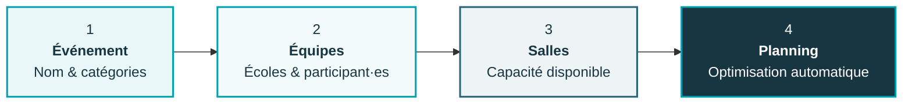
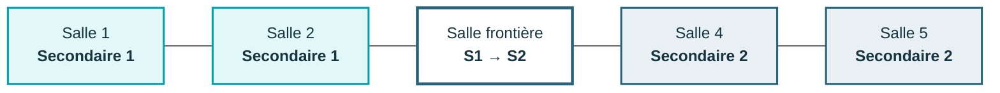
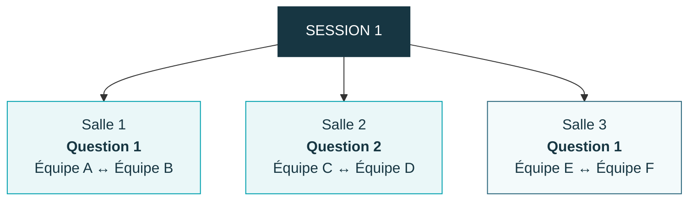

<div align="center">


# Planificateur de débats

### La jeunesse débat

**Préparez une finale régionale et générez automatiquement un planning équilibré, cohérent et directement exploitable.**

<br>


<br><br>

[**▶ Utiliser l'application**](#utiliser) ·
[**🧭 Comprendre le fonctionnement**](#fonctionnement) ·
[**💻 Installer en local**](#installation) ·
[**⚙️ Détails techniques**](#technique)

</div>

---

<a id="utiliser"></a>

# 👋 Par où commencer ?

Pas besoin de connaître Python, GitHub ou l'optimisation mathématique pour utiliser le planificateur.

Choisissez simplement le mode qui correspond à votre besoin :

| 🌐 **Je veux simplement utiliser l'application** | 💾 **Je veux conserver mes événements** |
|---|---|
| Aucune installation nécessaire | Installation sur votre ordinateur |
| Utilisation directement dans le navigateur | Même interface, exécutée localement |
| Idéal pour préparer rapidement un planning | Idéal pour travailler sur plusieurs événements |
| La sauvegarde durable n'est **pas garantie** | Les événements sont enregistrés sur votre ordinateur |
| **[▶ Ouvrir l'application](URL_APP_STREAMLIT)** | **[↓ Voir l'installation locale](#installation)** |

> [!IMPORTANT]
> ### En ligne ou en local ?
> L'application utilise une base SQLite enregistrée dans `data/app.db`.
>
> Sur une version hébergée avec Streamlit Community Cloud, les fichiers locaux peuvent être réinitialisés. **La version en ligne ne doit donc pas être considérée comme un système de sauvegarde durable.**
>
> Pour enregistrer un événement et le retrouver plus tard, utilisez l'application **en local sur votre ordinateur**.

---

<a id="fonctionnement"></a>

# 🧭 Comment ça marche ?

L'application vous accompagne du début à la fin sur **une seule page**.



### 1 · Définir l'événement

Choisissez le **nom de la finale** et les catégories présentes :

`Secondaire 1` · `Secondaire 2`

Vous pouvez organiser une seule catégorie ou les deux simultanément.

### 2 · Ajouter les équipes

Ajoutez les établissements participants et indiquez leur nombre d'équipes.

L'application crée automatiquement :

`Équipe A` · `Équipe B` · `Équipe C` · …

Les noms des deux participant·es peuvent être ajoutés si vous souhaitez obtenir un planning détaillé avec les rôles individuels.

### 3 · Choisir les salles

Indiquez simplement le nombre de salles disponibles.

L'application vérifie immédiatement que la configuration est structurellement réalisable avant de lancer l'optimisation.

### 4 · Générer le planning

Le moteur construit automatiquement le planning en tenant compte :

- des équipes ;
- des catégories ;
- des questions ;
- des rôles ;
- des adversaires ;
- des salles ;
- du nombre minimal de sessions.

Le résultat est ensuite **validé indépendamment** avant d'être affiché.

---

# ✨ Ce que l'application fait pour vous

| | |
|---|---|
| 🎯 **Planning automatique**<br>Le planning complet est construit sans devoir répartir manuellement chaque équipe. | 🏫 **Gestion des établissements**<br>Plusieurs équipes peuvent être ajoutées rapidement pour une même école. |
| 👥 **Gestion des participant·es**<br>Les noms peuvent être renseignés uniquement lorsque vous en avez besoin. | 🧠 **Optimisation exacte**<br>Le moteur recherche une solution valide puis améliore la qualité du planning. |
| 🚪 **Organisation intelligente des salles**<br>Les deux catégories sont séparées autant que possible. | ✅ **Contrôle automatique**<br>Le planning final est vérifié avant d'être présenté. |

---

# ✅ Ce qui est toujours garanti

Le planificateur distingue deux types de règles.

<table>
<tr>
<td width="50%" valign="top">

### 🔒 Contraintes obligatoires

Ces règles **ne peuvent jamais être violées**.

- exactement **2 débats par équipe** ;
- exactement **1 × Question 1** ;
- exactement **1 × Question 2** ;
- aucune équipe dans deux débats simultanément ;
- rotation individuelle obligatoire des rôles `1 ↔ 2` ;
- respect des catégories ;
- respect du nombre de salles disponibles ;
- validation indépendante du résultat.

</td>
<td width="50%" valign="top">

### ✨ Préférences d'optimisation

Elles sont respectées **autant que la configuration le permet**.

- éviter les équipes du même établissement ;
- diversifier les adversaires ;
- équilibrer les côtés ;
- réduire les changements de salle ;
- privilégier Question 1 avant Question 2 ;
- stabiliser les catégories dans les salles ;
- limiter les salles partagées.

</td>
</tr>
</table>

> [!NOTE]
> Si une préférence est mathématiquement impossible à respecter, le planning reste valide. L'application indique simplement la préférence qui n'a pas pu être satisfaite.

---

# 🚪 Une organisation des salles pensée pour le terrain

Avec deux catégories, le planificateur ne cherche pas seulement une salle libre.

Il essaie de créer des **zones simples à comprendre pendant la finale** :



### Secondaire 1 d'un côté, Secondaire 2 de l'autre

Lorsque la capacité le permet :

**Secondaire 1** utilise prioritairement les premières salles.

**Secondaire 2** utilise prioritairement les dernières.

Les salles inutilisées peuvent rester au milieu afin de conserver une séparation visuelle claire entre les catégories.

---

## ↔️ La salle frontière

Si une salle doit nécessairement accueillir les deux catégories, elle devient autant que possible une **salle frontière**.

Au lieu de produire ceci :

```text
S1 → S2 → S1 → S2
```

le planificateur privilégie :

```text
S1 → S1 → S2 → S2
```

La salle ne change ainsi de catégorie qu'une seule fois lorsque cela est possible.

Cela facilite notamment :

**la signalétique · l'organisation des jurys · les déplacements · la gestion des salles**

---

## ❓ Et les deux questions ?

Une même salle peut accueillir **Question 1 et Question 2** au cours de la finale.

C'est parfaitement normal.

Cela :

- n'est pas une erreur ;
- n'est pas un avertissement ;
- ne pénalise pas le planning ;
- n'influence pas négativement l'attribution des salles.

La logique de séparation concerne principalement les **catégories**, pas les questions.

---

# 🗓️ À quoi ressemble le résultat ?

Le planning est organisé de la manière la plus naturelle pour une utilisation pendant l'événement :



L'interface propose ensuite plusieurs niveaux de lecture.

### 🃏 Cartes par session et par salle

La vue principale est pensée pour être immédiatement lisible le jour de la finale.

Chaque carte contient les informations essentielles du débat.

### 📋 Tableau complet

Une vue tabulaire rassemble tout le planning pour permettre une consultation globale.

### 🛠️ Contrôles techniques

Les vérifications et éventuelles préférences impossibles à satisfaire sont placées séparément afin de ne pas encombrer le planning principal.

---

<a id="installation"></a>

# 💻 Installation locale

Vous souhaitez **enregistrer vos événements** et pouvoir les rouvrir plus tard ?

Installez l'application sur votre ordinateur.

Aucune connaissance en programmation n'est nécessaire : les commandes ci-dessous peuvent être copiées telles quelles.

---

## ① Télécharger le projet

Sur cette page GitHub :

**Code → Download ZIP**

Puis :

1. ouvrez le fichier ZIP téléchargé ;
2. extrayez son contenu dans le dossier de votre choix ;
3. ouvrez le dossier `Debate_Planner_JD_FR`.

---

## ② Installer Python

L'application nécessite :

**Python 3.11 ou plus récent**

Vous pouvez vérifier votre installation avec :

```bash
python --version
```

---

## ③ Installer l'application

<details open>
<summary><strong>🪟 Windows — PowerShell</strong></summary>

<br>

Ouvrez PowerShell dans le dossier de l'application, puis exécutez :

```powershell
python -m venv .venv
.venv\Scripts\Activate.ps1
python -m pip install --upgrade pip
pip install -r requirements.txt
```

</details>

<details>
<summary><strong>🍎 macOS</strong></summary>

<br>

Ouvrez le Terminal dans le dossier de l'application, puis exécutez :

```bash
python -m venv .venv
source .venv/bin/activate
python -m pip install --upgrade pip
pip install -r requirements.txt
```

</details>

<details>
<summary><strong>🐧 Linux</strong></summary>

<br>

Ouvrez un terminal dans le dossier de l'application, puis exécutez :

```bash
python -m venv .venv
source .venv/bin/activate
python -m pip install --upgrade pip
pip install -r requirements.txt
```

</details>

---

## ④ Lancer l'application

Une fois l'environnement activé :

```bash
python -m streamlit run app.py
```

L'application devrait s'ouvrir automatiquement dans votre navigateur.

Sinon, ouvrez :

```text
http://localhost:8501
```

> [!TIP]
> Lors des utilisations suivantes, vous n'avez pas besoin de réinstaller les dépendances.
>
> Réactivez simplement `.venv`, puis relancez `python -m streamlit run app.py`.

---

# 💾 Sauvegarder ses événements

En utilisation locale, les événements sont enregistrés automatiquement dans la base :

```text
data/app.db
```

### Le fichier important à conserver

```text
Debate_Planner_JD_FR/
└── data/
    └── app.db   ← vos événements sauvegardés
```

Si vous changez d'ordinateur ou remplacez complètement le dossier de l'application, **conservez ce fichier**.

Pour restaurer vos événements, replacez simplement `app.db` dans :

```text
data/
```

---

# ❓ Questions fréquentes

<details>
<summary><strong>Est-ce que je dois installer quelque chose pour essayer l'application ?</strong></summary>

<br>

Non.

La version en ligne fonctionne directement dans le navigateur.

L'installation locale est uniquement nécessaire si vous souhaitez notamment **conserver durablement vos événements sur votre ordinateur**.

</details>

<details>
<summary><strong>Pourquoi la sauvegarde en ligne n'est-elle pas permanente ?</strong></summary>

<br>

L'application utilise actuellement une base SQLite locale.

Sur un hébergement Streamlit Community Cloud, le stockage local du serveur n'est pas garanti comme permanent et peut être réinitialisé.

Une installation locale permet au contraire de conserver directement `data/app.db` sur votre ordinateur.

</details>

<details>
<summary><strong>Dois-je entrer les noms des participant·es ?</strong></summary>

<br>

Non.

Les noms sont optionnels.

Vous pouvez générer un planning à partir des établissements et des équipes uniquement, puis activer la saisie détaillée si vous souhaitez afficher également les rôles individuels.

</details>

<details>
<summary><strong>Que se passe-t-il si ma configuration est impossible ?</strong></summary>

<br>

L'application effectue des contrôles structurels avant de lancer le solveur.

Une configuration manifestement impossible est donc signalée immédiatement plutôt que d'attendre inutilement une optimisation.

</details>

<details>
<summary><strong>Une salle peut-elle accueillir les deux questions ?</strong></summary>

<br>

Oui.

Une salle peut accueillir Question 1 et Question 2 à différents moments de la finale. Ce fonctionnement est normal et n'est pas considéré comme un problème.

</details>

---

<a id="technique"></a>

# ⚙️ Pour aller plus loin

Les sections suivantes ne sont **pas nécessaires pour utiliser l'application**.

Elles sont destinées aux personnes souhaitant comprendre le moteur, modifier le projet ou exécuter les tests.

---

<details>
<summary><strong>🧠 Comment fonctionne l'optimisation ?</strong></summary>

<br>

Le moteur utilise une optimisation **MILP — Mixed-Integer Linear Programming** via :

```python
scipy.optimize.milp
```

avec le solveur **HiGHS**.

Le problème est traité en deux niveaux.

### Contraintes dures

Le solveur doit obligatoirement produire un planning valide :

```text
2 débats / équipe
1 × Question 1
1 × Question 2
pas de double participation
rotation des rôles
capacité des salles respectée
```

### Optimisation de la qualité

Parmi les solutions valides, le solveur cherche ensuite à améliorer notamment :

```text
nombre de sessions
diversité des rencontres
rencontres intra-établissement
équilibre des côtés
ordre des questions
changements de salle
organisation des catégories
stabilité des salles
```

Une validation indépendante est exécutée après la résolution afin de vérifier le résultat final.

</details>

---

<details>
<summary><strong>🗂️ Architecture du projet</strong></summary>

<br>

```text
Debate_Planner_JD_FR/
│
├── app.py
│
├── requirements.txt
│
├── README.md
│
├── PROJECT_SOURCE.md
├── VERIFICATION.md
│
├── .streamlit/
│   └── config.toml
│
├── assets/
│   ├── logo.png
│   └── README.txt
│
├── components/
│   ├── event_form.py
│   ├── teams_form.py
│   ├── parameter_form.py
│   ├── schedule_view.py
│   └── ui_helpers.py
│
├── src/
│   ├── models.py
│   ├── optimizer.py
│   ├── validation.py
│   ├── database.py
│   └── utils.py
│
├── data/
│   └── app.db
│
└── tests/
    └── test_optimizer.py
```

### Répartition des responsabilités

| Partie | Rôle |
|---|---|
| `app.py` | orchestration de l'application Streamlit |
| `components/` | interface utilisateur |
| `src/models.py` | structures de données |
| `src/optimizer.py` | modèle d'optimisation MILP |
| `src/validation.py` | contrôle indépendant du planning |
| `src/database.py` | sauvegarde et chargement SQLite |
| `src/utils.py` | fonctions utilitaires |
| `tests/` | tests automatisés |
| `assets/` | ressources visuelles |

</details>

---

<details>
<summary><strong>🧪 Exécuter les tests</strong></summary>

<br>

Depuis le dossier du projet :

```bash
python -m pytest -q
```

La suite de tests couvre notamment :

- différentes tailles de finales ;
- les configurations avec peu de salles ;
- les deux catégories simultanément ;
- plusieurs équipes d'un même établissement ;
- les configurations structurellement impossibles ;
- les préférences impossibles à respecter ;
- la séparation des catégories ;
- le fonctionnement de la salle frontière ;
- la limitation des changements de catégorie ;
- la diversité des rencontres ;
- l'utilisation optimale des salles ;
- la répartition des capacités inutilisées ;
- le comportement des deux questions dans une même salle.

</details>

---

<details>
<summary><strong>💾 Fonctionnement de la base de données</strong></summary>

<br>

La persistance locale utilise **SQLite**.

Le fichier est créé automatiquement dans :

```text
data/app.db
```

La base contient notamment :

```text
events
schools
teams
```

Il n'est donc pas nécessaire de configurer un serveur de base de données externe pour utiliser l'application localement.

</details>

---

# 🧩 Technologies

<div align="center">

**Streamlit**  
Interface web

↓

**Python**  
Logique de l'application

↓

**SciPy · MILP · HiGHS**  
Optimisation du planning

↓

**SQLite**  
Sauvegarde locale

</div>

---

<div align="center">

<br>

### 🗣️ La jeunesse débat

**Moins de temps passé à construire le planning.  
Plus de temps consacré au débat.**

<br>

<sub>Planificateur de finales régionales · YES — Young Enterprise Switzerland</sub>

</div>