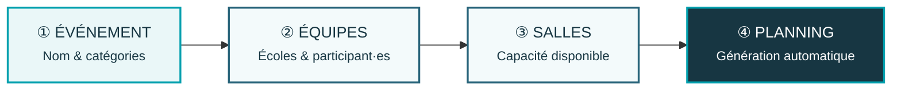
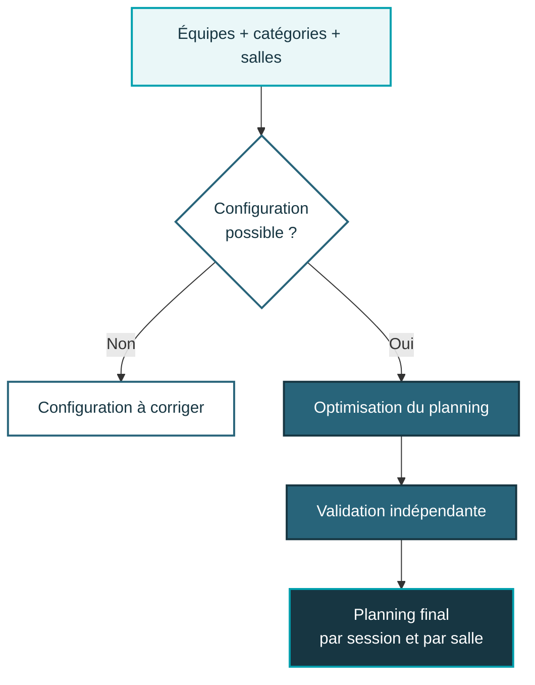
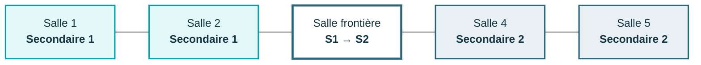
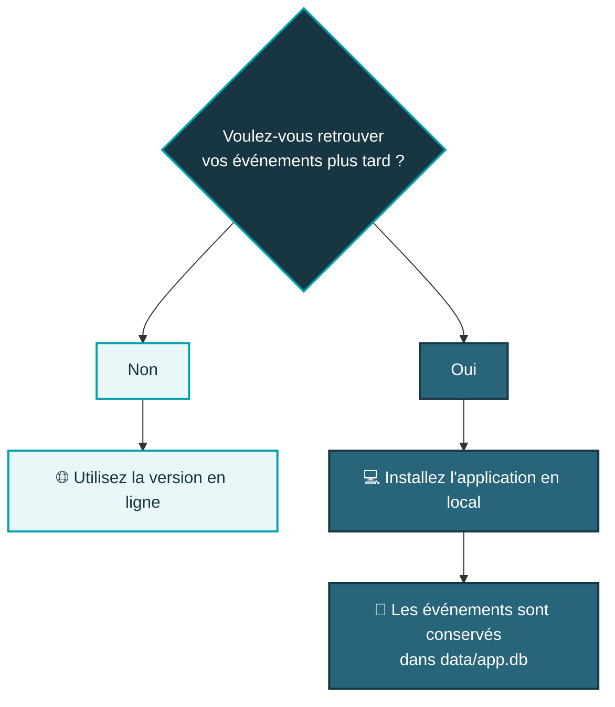

<div align="center">

<a href="https://debate-planner-jd-fr.streamlit.app/">
  
</a>

<br><br>

# Planificateur de débats

### La jeunesse débat

**Créez le planning complet d'une finale régionale en quelques étapes.**  
Équipes, questions, rôles, salles et sessions sont organisés automatiquement.

<br>

<a href="https://debate-planner-jd-fr.streamlit.app/">
  
</a>
&nbsp;
<a href="#-installation-locale">
  
</a>

<br><br>


<br><br>

**[Découvrir](#-en-30-secondes)** ·
**[Utiliser](#-comment-ça-marche)** ·
**[Sauvegarder](#-sauvegarde)** ·
**[Installer](#-installation-locale)** ·
**[FAQ](#-faq)** ·
**[Contact](#-aide--contact)**

</div>

---

## ✦ En 30 secondes

<table>
<tr>
<td width="50%" valign="top">

### 🌐 Je veux créer un planning

Aucune installation.

1. Ouvrir l'application
2. Ajouter les équipes
3. Indiquer les salles
4. Générer le planning

<br>

<a href="https://debate-planner-jd-fr.streamlit.app/">
  
</a>

</td>
<td width="50%" valign="top">

### 💾 Je veux conserver mes événements

Installez l'application sur votre ordinateur.

Vous profitez de la même interface, avec une **sauvegarde locale durable** de vos événements.

<br>

<a href="#-installation-locale">
  
</a>

</td>
</tr>
</table>

> [!IMPORTANT]
> **Version en ligne ≠ sauvegarde permanente.**
>
> Pour simplement créer un planning, utilisez l'application en ligne.  
> Pour **enregistrer et retrouver vos événements plus tard**, utilisez la version locale.

---

## 🧭 Comment ça marche ?

<div align="center">

**4 étapes. Une seule page. Aucun planning à construire manuellement.**

</div>



<table>
<tr>
<td align="center" width="25%">

### 01
**Événement**

Nom de la finale  
et catégories

</td>
<td align="center" width="25%">

### 02
**Équipes**

Établissements, équipes  
et participant·es

</td>
<td align="center" width="25%">

### 03
**Salles**

Nombre de salles  
et contrôle de faisabilité

</td>
<td align="center" width="25%">

### 04
**Planning**

Optimisation, validation  
et résultat final

</td>
</tr>
</table>

---

## ✨ Le planificateur s'occupe du reste

<table>
<tr>
<td width="33%" valign="top">

### 🎯 Deux débats
Chaque équipe participe à **exactement deux débats**.

</td>
<td width="33%" valign="top">

### ❓ Deux questions
Chaque équipe traite une fois **Question 1** et une fois **Question 2**.

</td>
<td width="33%" valign="top">

### 👥 Rôles équilibrés
Les deux participant·es alternent automatiquement les rôles **1 ↔ 2**.

</td>
</tr>

<tr>
<td width="33%" valign="top">

### 🏫 Rencontres
Le moteur cherche à diversifier les adversaires et à éviter les rencontres internes à un établissement.

</td>
<td width="33%" valign="top">

### 🚪 Salles
Les catégories restent séparées et stables autant que la configuration le permet.

</td>
<td width="33%" valign="top">

### ✅ Validation
Le planning obtenu est **contrôlé indépendamment** après l'optimisation.

</td>
</tr>
</table>

---

## 🗓️ Du formulaire au planning



Le résultat peut être consulté sous forme de **cartes par session et par salle**, avec une vue tableau complète et des contrôles techniques séparés.

---

## 🚪 Des salles organisées intelligemment

Lorsque `Secondaire 1` et `Secondaire 2` participent à la même finale, le moteur cherche à rendre l'organisation **simple à comprendre sur place**.



**L'idée :**

`Secondaire 1` → premières salles  
`Secondaire 2` → dernières salles

Si une salle doit accueillir les deux catégories, le planificateur privilégie une **salle frontière** :

```text
Secondaire 1  →  Secondaire 1  →  Secondaire 2  →  Secondaire 2
```

plutôt qu'une alternance permanente :

```text
Secondaire 1  →  Secondaire 2  →  Secondaire 1  →  Secondaire 2
```

> [!NOTE]
> Une salle peut parfaitement accueillir **Question 1 et Question 2**.
>
> Les questions n'ont pas besoin d'être séparées physiquement : la logique d'organisation des salles concerne principalement les **catégories**.

---

## 💾 Sauvegarde

### Ai-je besoin d'installer l'application ?



### Version en ligne

La version hébergée est idéale pour **créer rapidement un planning**, sans installer quoi que ce soit.

La base de données se trouve cependant sur l'instance Streamlit distante. Elle ne doit donc **pas être considérée comme un stockage permanent**.

### Version locale

En local, vos événements sont enregistrés sur votre ordinateur dans :

```text
data/app.db
```

> [!TIP]
> **C'est le fichier à conserver.**
>
> Si vous mettez l'application à jour ou changez d'ordinateur, sauvegardez `data/app.db` puis replacez-le dans le nouveau dossier `data/`.

---

## 💻 Installation locale

<details>
<summary><strong>🟦 Je n'ai jamais utilisé GitHub ou Python — que dois-je faire ?</strong></summary>

<br>

### 1 · Télécharger l'application

En haut de cette page GitHub :

**Code → Download ZIP**

Extrayez ensuite le fichier ZIP dans le dossier de votre choix.

### 2 · Installer Python

L'application nécessite **Python 3.11 ou plus récent**.

Vous pouvez vérifier votre version avec :

```bash
python --version
```

### 3 · Ouvrir un terminal

Ouvrez PowerShell ou un terminal **dans le dossier téléchargé**.

Choisissez ensuite les instructions correspondant à votre système ci-dessous.

</details>

<br>

<details open>
<summary><strong>🪟 Windows — PowerShell</strong></summary>

<br>

### Première installation

```powershell
python -m venv .venv
.venv\Scripts\Activate.ps1
python -m pip install --upgrade pip
pip install -r requirements.txt
python -m streamlit run app.py
```

### Les fois suivantes

```powershell
.venv\Scripts\Activate.ps1
python -m streamlit run app.py
```

</details>

<details>
<summary><strong>🍎 macOS / 🐧 Linux</strong></summary>

<br>

### Première installation

```bash
python -m venv .venv
source .venv/bin/activate
python -m pip install --upgrade pip
pip install -r requirements.txt
python -m streamlit run app.py
```

### Les fois suivantes

```bash
source .venv/bin/activate
python -m streamlit run app.py
```

</details>

<br>

Une fois lancée, l'application est disponible à :

**http://localhost:8501**

---

## ❔ FAQ

<details>
<summary><strong>🌐 Dois-je installer quelque chose pour utiliser le planificateur ?</strong></summary>

<br>

**Non.**

Vous pouvez utiliser directement :

**https://debate-planner-jd-fr.streamlit.app/**

L'installation locale est surtout utile si vous souhaitez **conserver durablement vos événements**.

</details>

<details>
<summary><strong>💾 Puis-je sauvegarder mes événements dans la version en ligne ?</strong></summary>

<br>

L'application peut utiliser sa base SQLite lorsqu'elle est hébergée, mais cette base se trouve sur l'instance distante.

Elle ne doit donc pas être considérée comme une sauvegarde permanente.

Pour une conservation fiable, utilisez l'application **en local**.

</details>

<details>
<summary><strong>👥 Dois-je renseigner les noms des participant·es ?</strong></summary>

<br>

Non.

Vous pouvez simplement ajouter les établissements et le nombre d'équipes.

La saisie des noms est utile lorsque vous souhaitez également gérer précisément la rotation des rôles individuels.

</details>

<details>
<summary><strong>❌ Que se passe-t-il si ma configuration est impossible ?</strong></summary>

<br>

L'application vérifie d'abord les conditions structurelles.

Si le nombre d'équipes ou de salles ne permet pas de créer un planning valide, le problème est signalé **avant le lancement de l'optimisation**.

</details>

<details>
<summary><strong>❓ Une même salle peut-elle accueillir Question 1 et Question 2 ?</strong></summary>

<br>

Oui.

C'est un fonctionnement normal et cela n'est **ni une erreur ni une préférence négative**.

</details>

<details>
<summary><strong>🚪 Pourquoi une salle accueille-t-elle parfois les deux catégories ?</strong></summary>

<br>

Cela peut être nécessaire lorsque le nombre de salles disponibles ne permet pas de séparer entièrement `Secondaire 1` et `Secondaire 2`.

Dans ce cas, le moteur cherche à créer une **salle frontière** qui passe une seule fois de `Secondaire 1` à `Secondaire 2`.

</details>

<details>
<summary><strong>🐛 J'ai trouvé un problème ou quelque chose ne fonctionne pas</strong></summary>

<br>

Merci de le signaler en indiquant si possible :

- ce que vous essayiez de faire ;
- le nombre d'équipes et de salles ;
- le message d'erreur affiché ;
- une capture d'écran si elle peut aider.

📧 **[yann.ducrest@gmail.com](mailto:yann.ducrest@gmail.com)**

</details>

---

## ⚙️ Pour les personnes qui veulent aller plus loin

> Cette partie n'est **pas nécessaire pour utiliser l'application**.

<details>
<summary><strong>🧠 Comment le planning est-il optimisé ?</strong></summary>

<br>

Le moteur utilise une optimisation **MILP** (*Mixed-Integer Linear Programming*) avec :

- `scipy.optimize.milp`
- le solveur **HiGHS**

### Contraintes obligatoires

Le planning doit notamment respecter :

- exactement deux débats par équipe ;
- exactement une Question 1 et une Question 2 ;
- aucune double participation pendant une session ;
- la rotation des rôles individuels ;
- le nombre de salles disponibles.

### Préférences optimisées

Parmi les plannings valides, le solveur cherche notamment à améliorer :

- le nombre de sessions ;
- la diversité des rencontres ;
- l'équilibre des côtés ;
- la chronologie des questions ;
- les changements de salle ;
- la séparation des catégories ;
- la stabilité des salles.

Une validation indépendante contrôle ensuite le planning obtenu.

</details>

<details>
<summary><strong>🧪 Exécuter les tests</strong></summary>

<br>

```bash
python -m pytest -q
```

Les tests couvrent notamment différentes tailles de finales, les configurations avec peu de salles, les deux catégories simultanément, les établissements avec plusieurs équipes et la logique des salles frontières.

</details>

<details>
<summary><strong>🧩 Technologies utilisées</strong></summary>

<br>

| Technologie | Utilisation |
|:---|:---|
| **Streamlit** | Interface utilisateur |
| **Python** | Logique de l'application |
| **SciPy** | Modèle d'optimisation MILP |
| **HiGHS** | Résolution du problème d'optimisation |
| **SQLite** | Sauvegarde locale |

</details>

### Documentation du projet

Pour entrer dans les détails du code :

**[`PROJECT_SOURCE.md`](PROJECT_SOURCE.md)** — structure et fonctionnement du projet  
**[`VERIFICATION.md`](VERIFICATION.md)** — vérification et validation

---

## ✉️ Aide & contact

<table>
<tr>
<td width="65%" valign="middle">

### Une question ? Un bug ? Une suggestion ?

Si quelque chose ne fonctionne pas ou si vous avez une proposition d'amélioration, n'hésitez pas à me contacter.

**Yann Ducrest**  
Auteur et mainteneur du planificateur

</td>

<td width="35%" align="center" valign="middle">

<a href="mailto:yann.ducrest@gmail.com">
  
</a>

<br><br>

<a href="https://github.com/YDucrest">
  
</a>

</td>
</tr>
</table>

---

<div align="center">


<br>

### La jeunesse débat

**Un planning plus simple à préparer.  
Une finale plus simple à organiser.**

<br>

<a href="https://debate-planner-jd-fr.streamlit.app/">
  
</a>

<br><br>

<sub>Développé par <strong>Yann Ducrest</strong></sub>

</div>