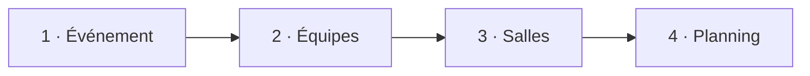

<p align="center">
  
</p>

<h1 align="center">Planificateur de débats</h1>

<p align="center">
  <strong>La jeunesse débat</strong>
</p>

<p align="center">
  Générer simplement un planning optimisé pour les finales régionales de <strong>La jeunesse débat</strong>.
</p>

<p align="center">
  <strong>Python 3.11+</strong> &nbsp;·&nbsp;
  <strong>Streamlit</strong> &nbsp;·&nbsp;
  <strong>SciPy MILP / HiGHS</strong> &nbsp;·&nbsp;
  <strong>SQLite</strong>
</p>

---

## À quoi sert l'application ?

Organiser une finale régionale implique de faire tenir de nombreuses contraintes dans un nombre limité de salles et de sessions :

- chaque équipe doit participer à exactement deux débats ;
- chaque équipe doit traiter une fois la **Question 1** et une fois la **Question 2** ;
- une équipe ne peut jamais participer à deux débats simultanément ;
- les rôles individuels doivent tourner ;
- les rencontres doivent être aussi variées que possible ;
- les salles doivent rester cohérentes entre les catégories ;
- le nombre de sessions doit être aussi faible que possible.

Le **Planificateur de débats** automatise cette organisation.

À partir des équipes inscrites et du nombre de salles disponibles, l'application construit un planning valide puis optimise les rencontres, les rôles, la chronologie et l'utilisation des salles grâce à un modèle de programmation linéaire en nombres entiers (**MILP**).

---

# Utiliser l'application

L'application peut être utilisée de deux manières.

| | 🌐 Version en ligne | 💻 Installation locale |
|---|---|---|
| **Installation** | Aucune | Python et les dépendances du projet |
| **Utilisation** | Directement dans le navigateur | Depuis votre propre ordinateur |
| **Génération du planning** | ✅ | ✅ |
| **Sauvegarde durable des événements** | ⚠️ Non garantie | ✅ |
| **Idéal pour** | Préparer rapidement un planning | Travailler sur plusieurs événements et conserver ses données |

### 🌐 Utilisation en ligne

La version hébergée permet d'utiliser directement le planificateur depuis un navigateur, sans installer Python ni télécharger le projet.

Il suffit de suivre les quatre étapes de l'application :

**Événement → Équipes → Salles → Planning**

> [!IMPORTANT]
> La version en ligne ne doit pas être utilisée comme système de sauvegarde durable.
>
> L'application utilise une base SQLite locale. Sur un hébergement Streamlit, les fichiers locaux du serveur peuvent être réinitialisés lors d'un redémarrage ou d'un redéploiement.
>
> Pour **enregistrer durablement des événements et les retrouver plus tard**, utilisez l'application en local.

### 💻 Utilisation locale

L'installation locale offre exactement la même interface, mais les événements sauvegardés restent sur votre ordinateur dans :

```text
data/app.db
```

C'est le mode recommandé pour préparer réellement une finale sur plusieurs jours ou conserver plusieurs événements.

Les instructions complètes se trouvent dans la section **Installation locale** plus bas.

---

# Un parcours en 4 étapes



L'ensemble du parcours reste visible sur **une seule page**.  
Un indicateur de progression montre immédiatement où en est la préparation.

| Étape | Action | Résultat |
|---|---|---|
| **1 · Définir l'événement** | Choisir le nom et les catégories | Le cadre de la finale est défini |
| **2 · Ajouter les équipes** | Ajouter les établissements et le nombre d'équipes | Les équipes A, B, C… sont créées automatiquement |
| **3 · Choisir les salles** | Indiquer le nombre de salles disponibles | La faisabilité est vérifiée immédiatement |
| **4 · Générer le planning** | Lancer l'optimisation | Le planning optimal est construit et contrôlé |

Les noms des participant·es peuvent également être renseignés dans un tableau éditable lorsque ce niveau de détail est nécessaire.

---

# Ce que le planificateur garantit

Certaines règles sont des **contraintes absolues** : un planning qui ne les respecte pas n'est jamais accepté.

| Règle | Garantie |
|---|:---:|
| Deux débats par équipe | ✅ |
| Une fois **Question 1** par équipe | ✅ |
| Une fois **Question 2** par équipe | ✅ |
| Aucun double débat pendant une même session | ✅ |
| Rotation des rôles individuels `1 ↔ 2` | ✅ |
| Respect des catégories | ✅ |
| Respect du nombre de salles disponibles | ✅ |
| Validation indépendante du planning après optimisation | ✅ |

Les configurations structurellement impossibles sont détectées **avant** le lancement du solveur afin d'éviter une attente inutile.

---

# Ce que le planificateur optimise

Une fois toutes les contraintes obligatoires respectées, le moteur cherche le planning le plus pratique possible.

Il privilégie notamment :

1. le **nombre minimal de sessions** ;
2. l'évitement des rencontres entre équipes du même établissement lorsque cela est possible ;
3. la diversité des adversaires et des établissements rencontrés ;
4. l'alternance des côtés et des rôles ;
5. **Question 1 avant Question 2** dans la chronologie d'une équipe lorsque possible ;
6. une organisation cohérente des salles ;
7. un changement de salle entre les deux débats d'une équipe lorsque la configuration le permet.

L'optimisation repose sur `scipy.optimize.milp` et le solveur **HiGHS**.

---

# Organisation des salles

Lorsque les deux catégories participent à la même finale, l'objectif n'est pas simplement de trouver une salle libre.

Le planificateur cherche aussi à créer une organisation **stable et intuitive sur le terrain**.

## Séparer les catégories autant que possible

Les premières salles sont prioritairement utilisées par **Secondaire 1**, tandis que les dernières salles sont prioritairement utilisées par **Secondaire 2**.

Par exemple, avec cinq salles :

```text
Secondaire 1                         Secondaire 2
     ↓                                    ↓

[ Salle 1 ] [ Salle 2 ]   [ Salle 3 ]   [ Salle 4 ] [ Salle 5 ]
```

Si toutes les salles ne sont pas nécessaires, le planificateur peut conserver un espace entre les deux zones plutôt que de mélanger inutilement les catégories.

## La salle frontière

Lorsque le nombre de salles oblige les deux catégories à partager une salle, le solveur cherche à créer une **salle frontière**.

L'idée est simple :

```text
Début de la journée

Salle 1        Salle 2        Salle 3
   S1             S1             S2


Fin de la journée

Salle 1        Salle 2        Salle 3
   S1             S2             S2
                  ↑
            salle frontière
```

La salle partagée passe ainsi idéalement :

**Secondaire 1 → Secondaire 2**

et évite des alternances du type :

**Secondaire 1 → Secondaire 2 → Secondaire 1 → Secondaire 2**

Cette logique facilite la gestion des jurys, du matériel et de la signalétique pendant l'événement.

## Question 1 et Question 2 dans une même salle

> [!NOTE]
> Une salle peut parfaitement accueillir **Question 1 et Question 2** au cours de la journée.

Ce comportement est normal :

- ce n'est **pas une anomalie** ;
- ce n'est **pas une préférence non satisfaite** ;
- ce n'est **pas un critère négatif** pour l'attribution des salles.

La séparation physique concerne principalement les **catégories**, pas les questions.

---

# Résultat généré

Une fois l'optimisation terminée, le planning est présenté sous plusieurs formes complémentaires.

### Vue principale

Les débats sont regroupés par :

**Session → Salle**

Chaque débat apparaît sous forme de carte afin de retrouver immédiatement :

- la catégorie ;
- la question ;
- les équipes ;
- les côtés attribués ;
- les participant·es et leurs rôles.

### Vue tableau

Une vue tabulaire complète permet de consulter rapidement l'ensemble du planning et facilite son utilisation opérationnelle.

### Contrôles techniques

Les informations de validation et les préférences qui n'ont éventuellement pas pu être satisfaites sont placées dans un onglet séparé.

L'écran principal reste ainsi centré sur ce qui est utile pendant l'organisation de la finale.

---

# Installation locale

## Prérequis

- **Python 3.11 ou plus récent**
- le projet téléchargé sur votre ordinateur

Vous pouvez récupérer le projet depuis GitHub avec **Code → Download ZIP**, puis extraire l'archive.

Si vous utilisez Git :

```bash
git clone <URL-du-dépôt-GitHub>
cd Debate_Planner_JD_FR
```

## 1. Créer un environnement virtuel

<details open>
<summary><strong>Windows — PowerShell</strong></summary>

<br>

```powershell
python -m venv .venv
.venv\Scripts\Activate.ps1
python -m pip install --upgrade pip
pip install -r requirements.txt
```

</details>

<details>
<summary><strong>macOS / Linux</strong></summary>

<br>

```bash
python -m venv .venv
source .venv/bin/activate
python -m pip install --upgrade pip
pip install -r requirements.txt
```

</details>

## 2. Lancer l'application

Depuis le dossier du projet :

```bash
python -m streamlit run app.py
```

Streamlit ouvre normalement l'application automatiquement dans le navigateur.

Sinon, ouvrez :

```text
localhost:8501
```

---

# Sauvegarde locale

En fonctionnement local, les événements enregistrés sont stockés dans :

```text
data/app.db
```

Ce fichier contient la base SQLite utilisée par l'application.

> [!IMPORTANT]
> **`data/app.db` est le fichier à conserver si vous souhaitez garder vos événements.**

### Mettre l'application à jour sans perdre ses événements

Si vous remplacez manuellement le dossier du projet par une nouvelle version :

1. copiez `data/app.db` dans un endroit sûr ;
2. installez ou extrayez la nouvelle version ;
3. replacez votre fichier `app.db` dans le dossier `data/`.

Si vous utilisez Git, les fichiers de base de données sont ignorés par `.gitignore`, ce qui évite normalement qu'une mise à jour du code n'écrase vos données locales.

---

# Tests et validation

La suite automatisée peut être exécutée avec :

```bash
python -m pytest -q
```

Elle vérifie notamment :

- différentes tailles de finales ;
- un nombre réduit de salles ;
- l'utilisation simultanée de **Secondaire 1** et **Secondaire 2** ;
- plusieurs équipes provenant du même établissement ;
- le blocage des nombres d'équipes incompatibles ;
- les préférences impossibles à satisfaire ;
- la séparation des catégories entre les salles lorsque cela est possible ;
- le comportement de la salle frontière lorsqu'un partage est nécessaire ;
- la stabilité des changements de catégorie ;
- la répartition des salles depuis les deux extrémités ;
- le placement des capacités inutilisées ;
- la diversité des rencontres entre établissements ;
- l'absence de signalement négatif lorsqu'une salle accueille les deux questions.

Le planning final est également contrôlé par une validation indépendante du modèle d'optimisation.

---

# Architecture du projet

<details>
<summary><strong>Afficher l'architecture technique</strong></summary>

<br>

```text
Debate_Planner_JD_FR/
│
├── app.py                      # Point d'entrée Streamlit
├── requirements.txt            # Dépendances Python
│
├── .streamlit/
│   └── config.toml             # Configuration Streamlit
│
├── src/                        # Logique métier
│   ├── models.py               # Modèles de données
│   ├── optimizer.py            # Optimisation MILP
│   ├── validation.py           # Validation indépendante
│   ├── database.py             # Persistance SQLite
│   └── utils.py                # Utilitaires
│
├── components/                 # Interface utilisateur
│   ├── event_form.py           # Étape 1 · Événement
│   ├── teams_form.py           # Étape 2 · Équipes
│   ├── parameter_form.py       # Étape 3 · Salles
│   ├── schedule_view.py        # Étape 4 · Planning
│   └── ui_helpers.py           # Thème et composants visuels
│
├── assets/
│   └── logo.png                # Logo utilisé par l'interface
│
├── data/
│   └── app.db                  # Base locale créée automatiquement
│
├── tests/
│   └── test_optimizer.py       # Tests du moteur et des contraintes
│
├── PROJECT_SOURCE.md           # Documentation technique du code
├── VERIFICATION.md             # Notes de vérification
└── README.md
```

### Fichiers nécessaires à l'application

Le fonctionnement repose principalement sur :

```text
app.py
requirements.txt
.streamlit/
src/
components/
assets/
```

Le dossier `data/` est créé/utilisé pour la sauvegarde locale.

Les fichiers de documentation et les tests ne sont pas nécessaires pour simplement lancer l'application.

</details>

---

# Moteur d'optimisation

<details>
<summary><strong>Pour aller plus loin — fonctionnement technique</strong></summary>

<br>

Le planning est formulé comme un problème de **Mixed-Integer Linear Programming (MILP)**.

Le modèle détermine conjointement :

- quelles équipes se rencontrent ;
- sur quelle question ;
- pendant quelle session ;
- dans quelle salle ;
- de quel côté elles débattent ;
- comment répartir les catégories dans les salles.

Les contraintes obligatoires assurent la validité du planning.

Des objectifs hiérarchisés permettent ensuite de départager les différentes solutions valides en privilégiant les configurations les plus pratiques pour l'organisation réelle d'une finale.

Le solveur est appelé via :

```python
scipy.optimize.milp
```

avec **HiGHS** comme moteur d'optimisation.

Une validation séparée est exécutée après la résolution afin de contrôler indépendamment les principales contraintes.

</details>

---

<p align="center">
  <strong>La jeunesse débat</strong><br>
  Un planning plus simple à préparer, plus cohérent à utiliser et automatiquement vérifié.
</p>