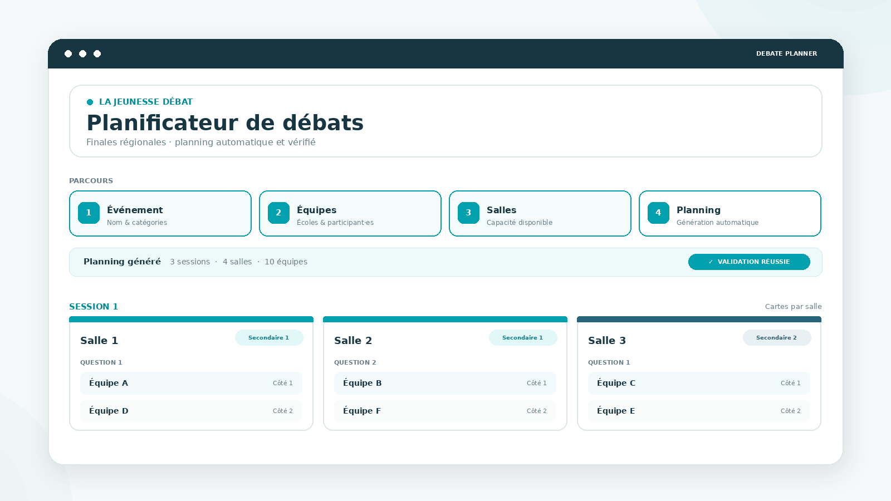

<div align="center">


# Planificateur de débats

### La jeunesse débat

**Préparez une finale régionale et générez automatiquement un planning clair, équilibré et prêt à l'emploi.**

<br>

<a href="https://debate-planner-jd-fr.streamlit.app/">
  
</a>
&nbsp;
<a href="#installation-locale">
  
</a>

<br><br>

<a href="#commencer">Commencer</a>
&nbsp;·&nbsp;
<a href="#fonctionnement">Fonctionnement</a>
&nbsp;·&nbsp;
<a href="#faq">FAQ</a>
&nbsp;·&nbsp;
<a href="#contact">Contact</a>

<br><br>

<sub>Python 3.11+ · Streamlit · SciPy / HiGHS · SQLite</sub>

</div>

<br>

<a href="https://debate-planner-jd-fr.streamlit.app/">
  
</a>

<p align="center">
  <sub>↑ Cliquez sur l'aperçu pour ouvrir le planificateur</sub>
</p>

---

<a id="commencer"></a>

## Commencer

### 🌐 Je veux simplement créer un planning

**Aucune installation.** Ouvrez l'application, ajoutez vos équipes et vos salles, puis générez le planning.

<a href="https://debate-planner-jd-fr.streamlit.app/">
  
</a>

<br><br>

### 💾 Je veux enregistrer mes événements

Installez l'application sur votre ordinateur. Les événements sont alors conservés localement dans `data/app.db`.

<a href="#installation-locale">
  
</a>

> [!IMPORTANT]
> La version en ligne est idéale pour créer un planning, mais elle ne doit pas être considérée comme un système de **sauvegarde permanente**.

---

<a id="fonctionnement"></a>

## En 4 étapes

<p align="center">
  <kbd>① Événement</kbd>
  &nbsp;&nbsp;→&nbsp;&nbsp;
  <kbd>② Équipes</kbd>
  &nbsp;&nbsp;→&nbsp;&nbsp;
  <kbd>③ Salles</kbd>
  &nbsp;&nbsp;→&nbsp;&nbsp;
  <kbd>④ Planning</kbd>
</p>

**① Événement** — nom de la finale et catégories.  
**② Équipes** — établissements, équipes et participant·es si nécessaire.  
**③ Salles** — nombre de salles disponibles et contrôle immédiat de la configuration.  
**④ Planning** — optimisation, validation et affichage du résultat.

<br>

<div align="center">


</div>

<br>

Le moteur cherche ensuite le planning le plus pratique possible : **moins de sessions, rencontres diversifiées, côtés équilibrés et salles organisées de manière cohérente**.

---

## Utilisation & sauvegarde

<details open>
<summary><strong>🌐 Utilisation en ligne</strong></summary>

<br>

La version en ligne fonctionne directement dans le navigateur :

**https://debate-planner-jd-fr.streamlit.app/**

Elle permet de préparer et générer un planning sans rien installer.

</details>

<details>
<summary><strong>💾 Sauvegarde locale</strong></summary>

<br>

Pour conserver durablement vos événements, utilisez l'application en local.

Les données sont stockées dans :

```text
data/app.db
```

> [!TIP]
> `app.db` est le fichier à conserver lors d'une mise à jour ou d'un changement d'ordinateur.

</details>

---

<a id="installation-locale"></a>

## Installation locale

<details>
<summary><strong>👋 Je n'ai jamais utilisé GitHub ou Python</strong></summary>

<br>

**1. Télécharger le projet**

Cliquez sur **Code → Download ZIP**, puis décompressez le dossier.

**2. Vérifier Python**

Python **3.11 ou plus récent** est recommandé.

```bash
python --version
```

**3. Choisir votre système**

Utilisez ensuite l'une des procédures ci-dessous.

</details>

<details>
<summary><strong>🪟 Windows — PowerShell</strong></summary>

<br>

**Première installation**

```powershell
python -m venv .venv
.venv\Scripts\Activate.ps1
python -m pip install --upgrade pip
pip install -r requirements.txt
python -m streamlit run app.py
```

**Les fois suivantes**

```powershell
.venv\Scripts\Activate.ps1
python -m streamlit run app.py
```

</details>

<details>
<summary><strong>🍎 macOS / 🐧 Linux</strong></summary>

<br>

**Première installation**

```bash
python -m venv .venv
source .venv/bin/activate
python -m pip install --upgrade pip
pip install -r requirements.txt
python -m streamlit run app.py
```

**Les fois suivantes**

```bash
source .venv/bin/activate
python -m streamlit run app.py
```

</details>

<details>
<summary><strong>🌐 Ouvrir l'application locale</strong></summary>

<br>

Streamlit ouvre normalement l'application automatiquement.

Sinon :

```text
http://localhost:8501
```

</details>

---

<a id="faq"></a>

## FAQ

<details>
<summary><strong>Dois-je installer quelque chose pour utiliser l'application ?</strong></summary>

<br>

Non. La version en ligne fonctionne directement dans votre navigateur.

L'installation locale est surtout utile si vous souhaitez conserver vos événements de manière durable.

</details>

<details>
<summary><strong>Mes événements sont-ils sauvegardés dans la version en ligne ?</strong></summary>

<br>

La version hébergée ne doit pas être considérée comme un stockage permanent.

Pour conserver vos événements de manière fiable, utilisez l'application en local.

</details>

<details>
<summary><strong>Dois-je renseigner les noms des participant·es ?</strong></summary>

<br>

Non. Les noms sont optionnels.

Vous pouvez préparer un événement uniquement avec les établissements et le nombre d'équipes.

</details>

<details>
<summary><strong>Que se passe-t-il si la configuration est impossible ?</strong></summary>

<br>

L'application vérifie les contraintes structurelles avant de lancer l'optimisation.

Une configuration impossible est donc signalée immédiatement.

</details>

<details>
<summary><strong>Une salle peut-elle accueillir Question 1 et Question 2 ?</strong></summary>

<br>

Oui. C'est un fonctionnement normal du planificateur.

</details>

<details>
<summary><strong>J'ai trouvé un bug ou quelque chose ne fonctionne pas.</strong></summary>

<br>

Vous pouvez me contacter à **[yann.ducrest@gmail.com](mailto:yann.ducrest@gmail.com)**.

Pour faciliter le diagnostic, indiquez si possible le nombre d'équipes, le nombre de salles, le message affiché et une capture d'écran.

</details>

---

## Détails techniques

<details>
<summary><strong>⚙️ Moteur d'optimisation</strong></summary>

<br>

Le planning est formulé comme un problème **MILP** (*Mixed-Integer Linear Programming*).

Le moteur utilise `scipy.optimize.milp` avec le solveur **HiGHS**.

Les contraintes garantissent la validité du planning ; l'optimisation cherche ensuite à améliorer le nombre de sessions, les rencontres, les côtés et l'utilisation des salles.

Une validation indépendante contrôle la solution après résolution.

</details>

<details>
<summary><strong>🧪 Tests</strong></summary>

<br>

```bash
python -m pytest -q
```

La suite de tests vérifie les principales contraintes du moteur sur différentes configurations de finales.

</details>

<details>
<summary><strong>📚 Documentation du projet</strong></summary>

<br>

- [`PROJECT_SOURCE.md`](PROJECT_SOURCE.md) — fonctionnement interne du projet
- [`VERIFICATION.md`](VERIFICATION.md) — vérification et validation

</details>

---

<a id="contact"></a>

## Aide & contact

<div align="center">

**Une question, une suggestion ou un problème ?**

<br><br>

<a href="mailto:yann.ducrest@gmail.com">
  
</a>
&nbsp;
<a href="https://github.com/YDucrest">
  
</a>

<br><br>

**Yann Ducrest**  
Auteur & mainteneur

</div>

---

<div align="center">


### Un planning plus simple à préparer.  
### Une finale plus simple à organiser.

<br>

<a href="https://debate-planner-jd-fr.streamlit.app/">
  
</a>

</div>
